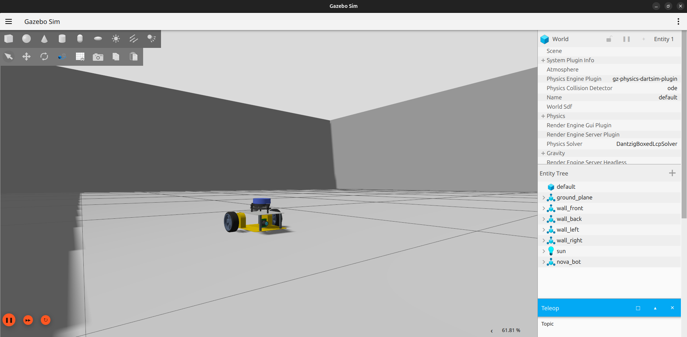
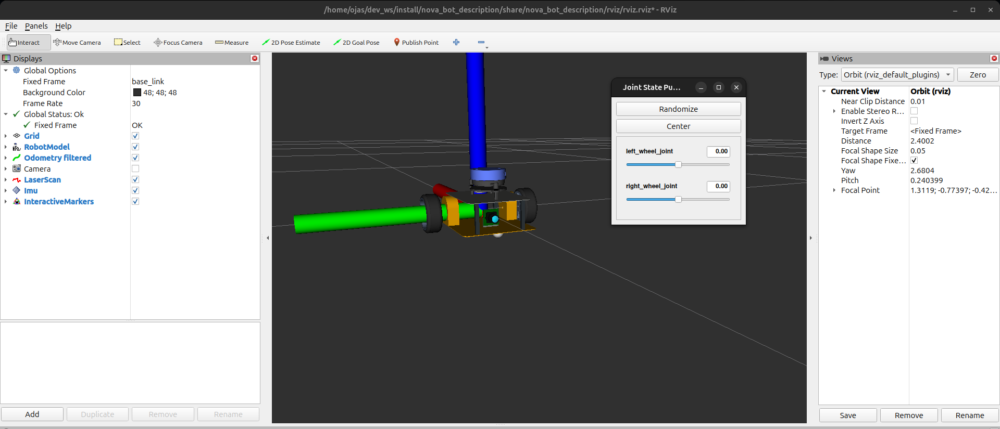

# Nova-Bot Autonomous Navigation Robot

<p align="center">
  
  
</p>

BharatBot is a high-performance differential drive robot designed for autonomous navigation in complex Lunar environments. For now a prototype design is build only for controlled indoor environment. Built on ROS 2 Jazzy with Gazebo Harmonic simulation, it features advanced lidar-based SLAM, real-time obstacle avoidance, and full Nav2 integration for autonomous operation.

## 🌟 Features

- **Autonomous Navigation**: Full Nav2 stack integration with dynamic obstacle avoidance
- **SLAM Mapping**: Real-time map building using SLAM Toolbox
- **AMCL Localization**: Adaptive Monte Carlo Localization for precise pose estimation
- **Sensor Suite**: 360° lidar (100 Hz), RGB camera, IMU sensor
- **High Performance**: 1.0 m/s max speed, optimized for fast navigation
- **Multiple Environments**: Home world with furniture, empty world, and maze
- **Gazebo Simulation**: Realistic physics simulation with sensor modeling
- **RViz Visualization**: Real-time robot state and sensor visualization

## 📦 Packages

### bharatbot_description
Robot URDF/Xacro model with complete sensor suite.
- Differential drive base with wheels
- 360° lidar sensor (100 Hz update rate)
- RGB camera with image bridge
- IMU sensor for orientation
- Visual and collision meshes

### bharatbot_gazebo
Gazebo Harmonic simulation environment.
- Home world with kitchen, bedroom, and furniture
- Empty world for testing
- Gazebo bridge for sensor data and robot control
- RViz integration for visualization

### bharatbot_navigation
Complete Nav2 navigation stack with optimized parameters.
- **Mapping**: SLAM Toolbox for real-time map building
- **Localization**: AMCL for robot pose estimation
- **Navigation**: Nav2 with DWB controller and obstacle avoidance
- **EKF**: Sensor fusion for improved odometry

## 🛠️ Requirements

- **ROS 2**: Jazzy Jalisco
- **Gazebo**: Harmonic
- **Operating System**: Ubuntu 24.04
- **Dependencies**:
  - `ros-jazzy-navigation2`
  - `ros-jazzy-nav2-bringup`
  - `ros-jazzy-slam-toolbox`
  - `ros-jazzy-ros-gz-sim`
  - `ros-jazzy-ros-gz-bridge`
  - `ros-jazzy-robot-localization`
  - `ros-jazzy-interactive-marker-twist-server`
  - `ros-jazzy-rviz2`

## 📥 Installation

```bash
# Create workspace
mkdir -p ~/ros2_ws/src
cd ~/ros2_ws/src

# Clone repository
git clone https://github.com/YOUR_USERNAME/bharatbot.git
cd ..

# Install dependencies
rosdep install --from-paths src --ignore-src -r -y

# Build workspace
colcon build --symlink-install

# Source workspace
source install/setup.bash
```

## 🚀 Usage

### 1. Gazebo Simulation
Launch the robot in Gazebo simulation:
```bash
ros2 launch bharatbot_gazebo gazebo.launch.py
```

Optional parameters:
```bash
ros2 launch bharatbot_gazebo gazebo.launch.py world:=home.sdf x:=2.5 y:=1.5 yaw:=-1.5707
```

### 2. Robot Visualization
View robot model without simulation:
```bash
ros2 launch bharatbot_description display.launch.py
```

### 3. SLAM Mapping
Create a map of the environment:
```bash
# Launch mapping with RViz
ros2 launch bharatbot_navigation mapping.launch.py

# Drive robot with keyboard (in new terminal)
ros2 run teleop_twist_keyboard teleop_twist_keyboard

# Save map when done
ros2 run nav2_map_server map_saver_cli -f ~/maps/my_map
```

### 4. Autonomous Navigation
Navigate autonomously using the saved map:
```bash
ros2 launch bharatbot_navigation navigation.launch.py
```
Use RViz to set navigation goals with "2D Goal Pose" tool.

### 5. Localization Only
Localize robot on existing map:
```bash
ros2 launch bharatbot_navigation localization.launch.py
```

## 📊 Performance

- **Max Linear Velocity**: 1.0 m/s
- **Max Angular Velocity**: 1.5 rad/s
- **Navigation Speed**: 0.8 m/s
- **Lidar Update Rate**: 100 Hz
- **Lidar Range**: 0.12m - 10.0m, 360 samples
- **Odometry Frequency**: 50 Hz

## 🎮 Keyboard Teleop Controls

```
Moving around:
   u    i    o
   j    k    l
   m    ,    .

q/z : increase/decrease max speeds by 10%
w/x : increase/decrease only linear speed by 10%
e/c : increase/decrease only angular speed by 10%
```

## 📁 Project Structure

```
nova-bot/
├── bharatbot_description/      # Robot URDF models and meshes
│   ├── urdf/                  # URDF/Xacro files
│   │   ├── bharatbot.urdf.xacro
│   │   ├── bharatbot.gazebo.xacro
│   │   ├── common/            # Properties, inertia, positions
│   │   └── component/         # Base, wheels, sensors
│   ├── meshes/                # 3D models (visual & collision)
│   │   ├── visual/
│   │   └── collision/
│   ├── rviz/                  # RViz configurations
│   └── launch/                # Display launch files
├── bharatbot_gazebo/           # Gazebo simulation
│   ├── worlds/                # SDF world files
│   │   ├── home.sdf
│   │   └── empty.sdf
│   └── launch/                # Gazebo launch files
├── bharatbot_navigation/       # Navigation stack
│   ├── config/                # Nav2 & SLAM parameters
│   │   ├── amcl_localization.yaml
│   │   ├── navigation.yaml
│   │   ├── slam_toolbox_mapping.yaml
│   │   └── ekf.yaml
│   ├── maps/                  # Saved maps
│   ├── rviz/                  # Navigation RViz configs
│   └── launch/                # Navigation launch files
└── media/                     # Documentation images
```

## 🔧 Configuration Files

- **AMCL Localization**: `bharatbot_navigation/config/amcl_localization.yaml`
- **Navigation**: `bharatbot_navigation/config/navigation.yaml`
- **SLAM Toolbox**: `bharatbot_navigation/config/slam_toolbox_mapping.yaml`
- **EKF**: `bharatbot_navigation/config/ekf.yaml`

## 🐛 Troubleshooting

**Robot not visible in RViz:**
- Check TF tree: `ros2 run tf2_tools view_frames`
- Verify all nodes running: `ros2 node list`
- For display.launch.py, ensure Fixed Frame is set to `base_link`

**Navigation not working:**
- Ensure initial pose is set in RViz (2D Pose Estimate)
- Check AMCL particle cloud is visible
- Verify map is loaded: `ros2 topic echo /map --once`

**Lidar not showing:**
- Check scan topic: `ros2 topic echo /scan --once`
- Verify `nova_lidar_link` in TF tree

**Display launch shows odom errors:**
- This is normal - change Fixed Frame in RViz to `base_link`

## 🤝 Contributing

Contributions are welcome! Please feel free to submit pull requests or open issues.

## 📄 License

This project is licensed under the Apache License 2.0 - see the LICENSE file for details.

## 👨‍💻 Author

**Ojas Thombare**

## 🙏 Acknowledgments

- ROS 2 Navigation Stack (Nav2)
- SLAM Toolbox
- Gazebo Simulator
- Open Robotics

Save map:
```bash
ros2 run nav2_map_server map_saver_cli -f ~/dev_ws/src/nova-bot/bharatbot_navigation/maps/my_map
```

### 4. Autonomous Navigation
```bash
ros2 launch bharatbot_navigation navigation.launch.py
```

Set goals using RViz "2D Goal Pose" button.

## Configuration

### Robot Speed
[wheel.gazebo.xacro](bharatbot_description/urdf/component/wheel/wheel.gazebo.xacro):
```xml
<max_linear_velocity>1.0</max_linear_velocity>
```

### Navigation Speed
[navigation.yaml](bharatbot_navigation/config/navigation.yaml):
```yaml
max_vel_x: 0.8
```

### Lidar Rate
[lidar.gazebo.xacro](bharatbot_description/urdf/component/lidar/lidar.gazebo.xacro):
```xml
<update_rate>100</update_rate>
```

## Topics

**Published:**
- `/cmd_vel` - Velocity commands
- `/odom` - Odometry
- `/scan` - Lidar (100Hz)
- `/camera/image` - Camera feed
- `/imu/data` - IMU

**Subscribed:**
- `/cmd_vel` - Control input
- `/map` - Navigation map

## Troubleshooting

**Map frame error in RViz:**
- Change Fixed Frame to `odom` when running only Gazebo
- Use `map` when running navigation

**Robot not visible:**
- Check Z spawn position > 0.1
- Enable RobotModel, TF, LaserScan in RViz

**Navigation not working:**
- Verify map is loaded
- Set initial pose with "2D Pose Estimate"
- Check `/scan` topic is publishing

## Requirements

- ROS 2 Jazzy
- Gazebo Harmonic
- Nav2
- SLAM Toolbox

## License

Apache-2.0

## Author

Siddhant
